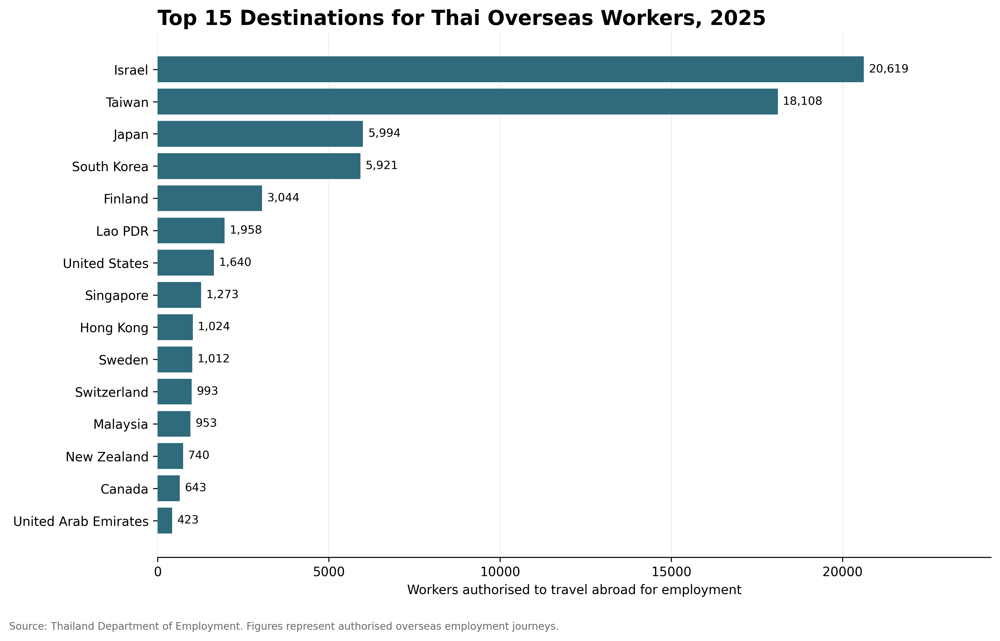

# Thai Overseas Workers

Analysis of the destinations and regional origins of Thai workers employed overseas.

## Research questions

- How many Thai workers are authorised to work overseas?
- Which countries are their main destinations?
- How have these destinations changed over time?
- Which Thai provinces and regions do overseas workers come from?

## Key findings

In 2025, 69,646 overseas employment journeys were authorised by the Thailand Department of Employment.

Israel was the largest destination with 20,619 workers, followed by Taiwan with 18,108. Together, these two destinations accounted for approximately 55.6% of the total. Japan and South Korea were the next largest destinations.

## Top destinations in 2025

## Data source

Thailand Department of Employment.

The figures represent workers authorised to travel abroad for employment. They do not represent all Thai citizens living overseas and may not fully include undocumented migration.
